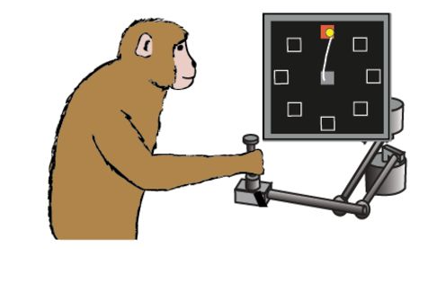
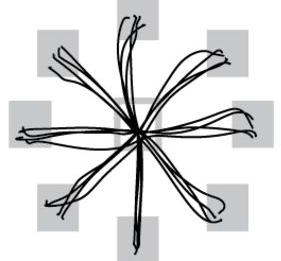

# Dataset 1: Neural signals from macaque motor cortex during a center-out reaching task

*Original paper*: Hatsopoulos, Joshi, and O’Leary. 2004. “Decoding Continuous and Discrete Motor Behaviors Using Motor and Premotor Cortical Ensembles.” *Journal of Neurophysiology* 92 (2): 1165–74.  [doi:10.1152/jn.01245.2003](https://journals.physiology.org/doi/full/10.1152/jn.01245.2003)

      

*Task*: monkeys were trained to move a cursor toward one of 8 possible
targets, starting from a central target. The targets were organized in 8
different directions (0, 45, 90, …, 315°)

*Data format*: The matrix *R* contains the firing rate of 143 neurons
recorded during 158 trials. The vector *direction* specifies the reach
direction for each of the 158 trials. Direction 1 corresponds to a
rightward reach (0 degrees), direction 2 to 45 degrees, direction 3 to
90 degrees (straight up), etc, with direction 8 corresponding to 315
degrees.

*Goal*: we will build a simple neural decoder to read out the intended
movement of the monkey and control a robotic arm.

To get you started:

1)  Can you tell which direction the monkey is moving simply by looking
    at one neuron? Let’s pick the first neuron of the *R* matrix. Plot
    the mean firing rate of this neuron for all 8 directions separately.
    Given that spiking activity is noisy, how would you quantify the
    uncertainty in the firing rate? (Standard deviation? Standard error?
    Bootstrapping?)

1)  Can you better predict the direction if you use two neurons instead
    of one? Let’s pick neuron 1 and 2 of the *R* matrix. Using a 2D
    scatter plot, plot the firing rate of neuron 2 as a function of
    neuron 1, and color each trial according to the reach direction.
    What do you notice?

1)  Now let’s include ALL neurons. Technically, you would need a
    143-dimensional plot to visualize the data, which is not possible.
    So instead, we will use principal component analysis (PCA) to reduce
    the data to lower dimensions (tip: there is one important step to
    apply to the data before applying PCA, what is it?). Compute the
    amount of the total variance you can explain using 1, 2 or 3
    dimensions (i.e., scree plot)
    
1) In the previous step, you applied PCA to explain variance across and within condition. However, we might be more interested to look at the dimensions that explain differences across conditions only. Redo PCA now on the trial-averaged activity (that is, on a matrix of size # neuron x # condition), then project the single-trial data onto the top 2 PCs. What do you notice?     

1)  Let’s visualize the original data in the plane spanned by the top 2
    PCs. How do you interpret the unit vector describing this plane? Do
    some neurons contribute more than others to these dimensions? ​​Plot
    the projection of firing rates onto this 2D plane, and color the
    points according to the reach direction.

1)  Suppose we want to control a robotic hand that copies the monkey’s
    hand movements. Design a decoder (a linear system) that receives 143
    inputs (the firing rate of the 143 neurons) and generates 2 outputs
    that control the x (left-right) and y (up-down) motors of the
    robotic hand. How cool is that?
 
1)  One extra thing: you may have noticed that neurons tend to be active for nearby targets, showing a bell-shaped curve when plotting activity versus  direction. This phenomenon is referred to as “directional tuning”, and was first observed in the 80s by Georgopoulos (1982). To quantify this tuning, we will fit a Von Mises function (equivalent of a Gaussian on a circle) to each neuron individually; see Amirikian & Georgopoulos (2000) if needed. Plot the distribution of the Von Mises parameters (width and mean) across the population. 
    
*Resources*

- Understanding PCA: http://alexhwilliams.info/itsneuronalblog/2016/03/27/pca/
- Original Georgopoulos paper: https://www.jneurosci.org/content/2/11/1527
- Modeling paper for directional tuning: https://pubmed.ncbi.nlm.nih.gov/10678534/

# Dataset 2: Neural signals from macaque motor cortex during an instructed grasping task

*Original paper*: Brochier, Zehl, Hao, Duret, Sprenger, Denker, Grün, &
Riehle. 2018. “Massively Parallel Recordings in Macaque Motor Cortex
during an Instructed Delayed Reach-to-Grasp Task.” *Scientific Data* 5
(April): 180055.

*Task*: Monkeys were trained to grasp an object using 2 possible hand grips (side grip, SG, or precision grip, PG) and subsequently pull and hold the object using 2 possible force levels (low force, LF, or high force, HF). On each trial, the animal had to wait for two successive instructions separated by a 1-s delay before initiating their movement. The grip and force instructions were displayed via a square of 4 light-emitting diodes (LEDs) as follows: the two leftmost (resp., rightmost) LEDs instructed SG (resp., PG), while the top (resp., bottom) LEDs instructed HF (resp., LF).

*Trial structure*: the animal started from a home position with their working hand pressing down on a pressure-sensitive switch. After a fixed delay, the central LED was illuminated to indicate the start of a new trial. After 400 ms, the grip instruction was presented for 300 ms, followed by a 1-s preparatory period with only the central LED on. At the end of the preparatory period, the force instruction was presented and also served as the imperative GO signal. At that point, the animal needed to (1) release the switch, (2) reach for the object with the appropriate grip and (3) pull and hold it with the appropriate force for 500 ms. The animal was subsequently rewarded if both the grip type and the force level used were correct. To initiate a new trial, the monkey had to return their working hand to the home position and press the switch.

*Data format*: dataset2 contains 2 data structures, called *monkeyL* and *monkeyN*. Each structure contains 7 fields:
- *spikes* is a 3-D tensor [*T*x*N*x*K*] containing the spiking activity of *N* neurons, across *K* trials and *T* times points. Spikes are binned in a 1-ms window (why do you think 1-ms?) and include data between Go-2000ms and Go+3500ms.
- *grip* is vector [*K*x1] containing the grip information for each trial (1 for SG, 2 for PG)
- *force* is vector [*K*x1] containing the force information for each trial (1 for HF, 2 for LF)
- *RT* is a vector [*K*x1] containing the reaction time on each trial (between Go and the switch release)
- *MT* is a vector [*K*x1] containing the movement time on each trial (between the switch release and the object touch)
- *PT* is a vector [*K*x1] containing the pulling time on each trial (between the object touch and the object release)
- *neuron* is a vector [*N*x1] containing the ID of each neuron. 

*Goal*: we will analyze preparatory neural activity to dynamically
decode monkeys’ intended grip and their reaction times on a
trial-by-trial basis.

To get you started:

1)  A good way to start analyzing dynamic neural activity is to visualize it… Make a summary plot with a subplot for each neuron showing the trial-averaged activity of the neuron as a function of time. Use 20-ms non-overlapping windows to bin the spikes. Additionally, you can smooth the data using a standard Gaussian kernel (SD=40 ms); use the smoother.m helper function if needed, or refer to https://matthew-brett.github.io/teaching/smoothing_intro.html#smoothing-with-the-kernel. Plot the SG and PG conditions on the same plot in different colors; and add vertical lines to indicate the time of Cue. Use the bootstrap method to compute confidence intervals. How many neurons would you say encode the grip information? For each grip-encoding neuron, how early in the cue/preparatory period can you decode the grip type?

1)  Now zooming out of individual neurons, let’s take a look at the dynamics of the population as a whole. Based on what you learned with dataset 1, you will reduce the dimensions of the data to visualize the dynamics. Use the helper function PCAneuralData.m to get you started. At the end of this step, you should have plotted the “neural trajectories” associated with each condition (PG and SG) in the same 3-D plot. How do you interpret the separation of the trajectories as time progresses? Do you think PCA is the best method to explain variance in the time domain? Why or why not?

1)  Now that you have visualized the high-D data in low-D to get some intuitions, let’s be more quantitative. To estimate how quickly you can decode the grip instruction in the cue/preparatory period, compute the instantaneous euclidean distance between the two trajectories. Perform this calculation both in the 3-D PC space and in the full space (including all neurons). Is there a difference? 

1)  Finally, let’s build a linear decoder to predict the reaction times
    of the monkey (gathered in the vector *RT*) based on the recorded
    neural activity. Pick a time point late in the preparatory period,
    and define a 200-ms window around that point to compute the firing
    rate of every neuron on each trial. Gather the data in a matrix *M*
    \[*K*x*N*\] where *K* is the number of trials and *N* is the number
    of neurons. Mathematically, the problem we want to solve is a linear
    regression; we want to find the vectors *X and X**0*
    \[*N*x1\] that minimize the difference *RT* -
    (*MX-X**0*). Use your favorite algorithm to solve this
    regression (note that you can also do it by hand, it’s fun).

1)  Now that you have your decoder weights (*X*) and biases
    (*X**0*), compute the error between the decoded and
    actual reaction times. What is wrong with this way of testing the
    decoder? Split the trials in half, and redo the previous step using
    the first half of the data. How well does your decoder do on your
    training (first half) versus test (second half) set? As a
    quantification of the decoding accuracy, compute the correlation
    between predicted and actual RT for the test set only. To get a
    confidence interval for the decoding accuracy, repeat this step 100
    times, each time picking a random half of the trials. As a control,
    do the same after shuffling the entries in the vector *RT* to obtain
    a null distribution for the decoding accuracy.

# Dataset 3: Neural signals from macaque dorsomedial cortex during a time interval task

*Original paper*: Meirhaeghe, Nicolas, Hansem Sohn, and Mehrdad
Jazayeri. 2021. “A Precise and Adaptive Neural Mechanism for Predictive
Temporal Processing in the Frontal Cortex.” *Neuron* 109 (18):
2995–3011.e5.

*Task*: monkeys were trained to measure various time intervals and
reproduce them by making saccadic eye movements

Coming soon...
